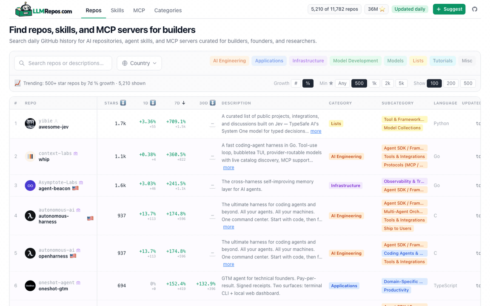

# 👋 Awesome Local LLMs

### 8,600+ open-source LLM, agent, and local inference repos, tracked daily

[**llmrepos.com**](https://llmrepos.com) sorts them by how fast they are gaining stars, not by how many they have.

---

## What this is

A curated list of open-source projects for building with LLMs, covering the whole stack: model weights, training code, inference runtimes, agent frameworks, end-user apps, and the lists and tutorials that help you learn.

Each repo is checked once a day for stars, 1d/7d/30d star growth, forks, contributors, open issues, language, license, creation date, and time since last commit.

Two ways to use it:

- [**llmrepos.com**](https://llmrepos.com) has all 8,600+ repos, with search, growth sorting, and filters by category, subcategory, language, and license.
- **This README** has the top 100 by stars, rewritten weekly.

Projects are organised into eight categories:

- **AI Engineering**: agent SDKs, orchestration, prompting & scaffolding, memory/RAG, tools & integrations, MCP, evaluation, and guardrails
- **Applications**: coding assistants, personal agents, productivity, content creation, research, data analytics, and automation
- **Infrastructure**: local runtimes, production serving, distributed & edge inference, optimisation, gateways, observability, and vector search
- **Model Development**: fine-tuning, training, RLHF, deep learning frameworks, dataset engineering, and interpretability
- **Models**: foundation, vision, audio/speech, embedding, on-device, and domain-specific model releases
- **Lists**: curated collections of prompts, tools, models, papers, and datasets
- **Tutorials**: getting-started guides, courses, roadmaps, and interview prep
- **Misc**: everything else

Each repo is tagged with one **category**, one or more **subcategories**, and a set of cross-cutting **keywords** (techniques, integrations, modalities, and domains such as `RAG`, `MCP`, or `Context engineering`).

**Contributions are welcome!** Suggest a repo I've missed by [opening an issue](https://github.com/vince-lam/awesome-local-llms/issues/new).

## How the project has changed

This started in 2024 as a markdown list of local LLM tools that I edited by hand and kept in sync with a Google Sheet. It went out of date faster than I could edit it, so it became a pipeline instead.

| | 2024 | 2026 |
|---|---|---|
| Repos tracked | ~40, picked by hand | 8,600+, found via the GitHub API and classified automatically |
| Refresh | Manual, later weekly | Daily, via GitHub Actions into a [Turso](https://turso.tech) (libSQL) database |
| Ranking | Total stars | 1d/7d/30d star growth, so a repo shows up within days of taking off |
| Scope | Local inference and chat UIs | Agents, RAG, coding assistants, serving, model development, evals |
| Surface | This README | [llmrepos.com](https://llmrepos.com), plus this README |

## Elsewhere

- My write-up on local LLM tooling: <https://vinlam.com/posts/local-llm-options/>
- Older exports, no longer updated: [Google Sheet](https://docs.google.com/spreadsheets/d/1Xv38p90V3GiJXjq0a3qc24056Vicn1I5MG6QiFE6nVE/edit?usp=sharing) and [Airtable](https://airtable.com/apparaKqezkq2LECD/shrE26kWFaVU1cvgb)

## Top 100 Open-Source LLM & Agent Projects

The table below shows the top 100 projects by stars, limited to repos with a commit in the last 60 days. It is rewritten weekly. The other 8,500 are on [llmrepos.com](https://llmrepos.com).

*Last Updated: 17/08/2026*

<!-- BEGIN_TABLE -->
|  # | Repo  | Category  | Tags  | About  |  Stars |  Forks |  Issues |  Contributors |  Releases | License  | Time Since Last Commit  |
|----------|----------|----------|----------|----------|----------|----------|----------|----------|----------|----------|----------|
|  1 | [openclaw](https://github.com/openclaw/openclaw)  | Applications  | Coding Agents & Assistants  | Your own personal AI assistant. Any OS. Any Platform. The lobster way. 🦞  | 386,513 |  81,217 |  3,405 |  0 |  235 | Other  | 0 days, 0 hrs, 0 mins  |
|  2 | [superpowers](https://github.com/obra/superpowers)  | AI Engineering  | Tools & Integrations  | An agentic skills framework & software development methodology that works.  | 272,923 |  24,407 |  155 |  0 |  12 | MIT License  | 4 days, 6 hrs, 42 mins  |
|  3 | [ECC](https://github.com/affaan-m/ECC)  | AI Engineering  | Tools & Integrations  | The agent harness performance optimization system. Skills, instincts, memory, security, and research-first development for Claude Code, Codex, Opencode, Cursor and beyond.  | 240,582 |  36,494 |  42 |  0 |  15 | MIT License  | 0 days, 3 hrs, 21 mins  |
|  4 | [hermes-agent](https://github.com/NousResearch/hermes-agent)  | AI Engineering  | Agent SDK / Framework, Agent Frontends / Chat UI  | The agent that grows with you  | 231,699 |  46,113 |  10,900 |  0 |  26 | MIT License  | 0 days, 0 hrs, 6 mins  |
|  5 | [skills](https://github.com/mattpocock/skills)  | AI Engineering  | Tools & Integrations  | Skills for Real Engineers. Straight from my .agents directory.  | 219,611 |  18,908 |  352 |  0 |  7 | MIT License  | 0 days, 10 hrs, 15 mins  |
|  6 | [n8n](https://github.com/n8n-io/n8n)  | AI Engineering  | Visual / Low-Code Builder, Multi-Agent Orchestration  | Fair-code workflow automation platform with native AI capabilities. Combine visual building with custom code, self-host or cloud, 400+ integrations.  | 200,946 |  60,179 |  342 |  0 |  763 | Other  | 0 days, 0 hrs, 1 mins  |
|  7 | [opencode](https://github.com/anomalyco/opencode)  | Applications  | Coding Agents & Assistants  | The open source coding agent.  | 198,259 |  25,543 |  3,907 |  0 |  860 | MIT License  | 0 days, 0 hrs, 1 mins  |
|  8 | [AutoGPT](https://github.com/Significant-Gravitas/AutoGPT)  | Applications  | Workflow & Task Automation  | AutoGPT is the vision of accessible AI for everyone, to use and to build on. Our mission is to provide the tools, so that you can focus on what matters.  | 186,648 |  46,062 |  293 |  0 |  117 | Other  | 0 days, 0 hrs, 0 mins  |
|  9 | [ollama](https://github.com/ollama/ollama)  | Infrastructure  | Local Runtime / Inference Engine  | Get up and running with Kimi-K2.6, GLM-5.2, MiniMax, DeepSeek, gpt-oss, Qwen, Gemma and other models.  | 178,742 |  17,438 |  2,406 |  0 |  245 | MIT License  | 0 days, 14 hrs, 51 mins  |
|  10 | [markitdown](https://github.com/microsoft/markitdown)  | AI Engineering  | Memory & Knowledge (RAG), Tools & Integrations  | Python tool for converting files and office documents to Markdown.  | 174,156 |  12,722 |  388 |  0 |  20 | MIT License  | 18 days, 13 hrs, 56 mins |
|  11 | [skills](https://github.com/anthropics/skills)  | AI Engineering  | Tools & Integrations  | Public repository for Agent Skills  | 169,820 |  20,214 |  315 |  0 |  0 | No license  | 3 days, 13 hrs, 8 mins  |
|  12 | [firecrawl](https://github.com/firecrawl/firecrawl)  | AI Engineering  | Computer & Browser Use  | The context API to search, scrape, and interact with the web at scale. 🔥  | 168,323 |  9,416 |  66 |  0 |  35 | GNU Affero General Public License v3.0  | 0 days, 2 hrs, 2 mins  |
|  13 | [prompts.chat](https://github.com/f/prompts.chat)  | AI Engineering  | Prompting & Scaffolding, Agent Frontends / Chat UI  | f.k.a. Awesome ChatGPT Prompts. Share, discover, and collect prompts from the community. Free and open source — self-host for your organization with complete privacy.  | 167,288 |  21,592 |  20 |  0 |  0 | Other  | 0 days, 4 hrs, 54 mins  |
|  14 | [transformers](https://github.com/huggingface/transformers)  | Infrastructure  | Language Bindings  | 🤗 Transformers: the model-definition framework for state-of-the-art machine learning models in text, vision, audio, and multimodal models, for both inference and training.  | 164,163 |  34,257 |  882 |  0 |  268 | Apache License 2.0  | 0 days, 0 hrs, 13 mins  |
|  15 | [langflow](https://github.com/langflow-ai/langflow)  | AI Engineering  | Visual / Low-Code Builder  | Langflow is a powerful tool for building and deploying AI-powered agents and workflows.  | 153,348 |  9,873 |  215 |  0 |  303 | MIT License  | 0 days, 1 hrs, 12 mins  |
|  16 | [dify](https://github.com/langgenius/dify)  | AI Engineering  | Visual / Low-Code Builder  | Build Agentic workflows, RAG pipelines, with rich AI model and tool support on one collaborative workspace. Deploy on cloud, VPC, or self-hosted, so teams move from prototype to production without rebuilding the stack.  | 152,664 |  24,107 |  288 |  0 |  168 | Other  | 0 days, 0 hrs, 3 mins  |
|  17 | [open-webui](https://github.com/open-webui/open-webui)  | AI Engineering  | Agent Frontends / Chat UI  | User-friendly AI Interface (Supports Ollama, OpenAI API, ...)  | 148,981 |  21,691 |  194 |  0 |  167 | Other  | 0 days, 0 hrs, 1 mins  |
|  18 | [agency-agents](https://github.com/msitarzewski/agency-agents)  | AI Engineering  | Agent SDK / Framework, Multi-Agent Orchestration  | A complete AI agency at your fingertips - From frontend wizards to Reddit community ninjas, from whimsy injectors to reality checkers. Each agent is a specialized expert with personality, processes, and proven deliverables.  | 145,908 |  23,577 |  58 |  0 |  0 | MIT License  | 10 days, 18 hrs, 45 mins |
|  19 | [langchain](https://github.com/langchain-ai/langchain)  | AI Engineering  | Agent SDK / Framework  | The agent engineering platform.  | 144,371 |  24,031 |  332 |  0 |  1,000 | MIT License  | 0 days, 0 hrs, 4 mins  |
|  20 | [system-prompts-and-models-of-ai-tools](https://github.com/x1xhlol/system-prompts-and-models-of-ai-tools) | Applications  | Coding Agents & Assistants  | FULL Augment Code, Claude Code, Cluely, CodeBuddy, Comet, Cursor, Devin AI, Junie, Kiro, Leap.new, Lovable, Manus, NotionAI, Orchids.app, Perplexity, Poke, Qoder, Replit, Same.dev, Trae, Traycer AI, VSCode Agent, Warp.dev, Windsurf, Xcode, Z.ai Code, Dia & v0. (And other Open Sourced) System Prompts, Internal Tools & AI Models  | 142,876 |  34,844 |  91 |  0 |  0 | GNU General Public License v3.0  | 5 days, 19 hrs, 16 mins  |
|  21 | [claude-code](https://github.com/anthropics/claude-code)  | AI Engineering  | Tools & Integrations  | Claude Code is an agentic coding tool that lives in your terminal, understands your codebase, and helps you code faster by executing routine tasks, explaining complex code, and handling git workflows - all through natural language commands.  | 141,714 |  22,751 |  14,087 |  0 |  189 | No license  | 0 days, 2 hrs, 36 mins  |
|  22 | [deepseek-harness](https://github.com/deepseek-ai/deepseek-harness)  | AI Engineering  | Agent SDK / Framework, Agent Frontends / Chat UI, Tools & Integrations, Protocols (MCP / A2A) | DeepSeek Harness: Everything is a Plugin.  | 140,447 |  14,237 |  0 |  0 |  0 | MIT License  | 3 days, 17 hrs, 51 mins  |
|  23 | [awesome-llm-apps](https://github.com/Shubhamsaboo/awesome-llm-apps)  | AI Engineering  | Memory & Knowledge (RAG)  | 100+ AI Agents, Agent Skills and RAG Apps - Free and Open Source.  | 132,927 |  19,556 |  6 |  0 |  0 | Apache License 2.0  | 0 days, 5 hrs, 34 mins  |
|  24 | [spec-kit](https://github.com/github/spec-kit)  | AI Engineering  | Tools & Integrations  | 💫 Toolkit to help you get started with Spec-Driven Development  | 129,618 |  11,602 |  160 |  0 |  212 | MIT License  | 2 days, 14 hrs, 33 mins  |
|  25 | [gstack](https://github.com/garrytan/gstack)  | AI Engineering  | Agent SDK / Framework  | Use Garry Tan's exact Claude Code setup: 23 opinionated tools that serve as CEO, Designer, Eng Manager, Release Manager, Doc Engineer, and QA  | 128,312 |  19,315 |  318 |  0 |  0 | MIT License  | 0 days, 4 hrs, 34 mins  |
|  26 | [ComfyUI](https://github.com/Comfy-Org/ComfyUI)  | Infrastructure  | Local Runtime / Inference Engine  | The most powerful and modular diffusion model GUI, api and backend with a graph/nodes interface.  | 128,010 |  15,070 |  4,105 |  0 |  153 | GNU General Public License v3.0  | 0 days, 0 hrs, 37 mins  |
|  27 | [cc-switch](https://github.com/farion1231/cc-switch)  | AI Engineering  | Tools & Integrations  | A cross-platform desktop All-in-One assistant for Claude Code, Codex, OpenCode, OpenClaw, Grok Build & Hermes Agent. Only official website: ccswitch.io  | 127,701 |  8,738 |  1,459 |  0 |  50 | MIT License  | 0 days, 1 hrs, 25 mins  |
|  28 | [llama.cpp](https://github.com/ggerganov/llama.cpp)  | Infrastructure  | Local Runtime / Inference Engine  | LLM inference in C/C++  | 124,277 |  21,795 |  754 |  0 |  1,000 | MIT License  | 0 days, 0 hrs, 28 mins  |
|  29 | [generative-ai-for-beginners](https://github.com/microsoft/generative-ai-for-beginners)  | AI Engineering  | Prompting & Scaffolding  | 21 Lessons, Get Started Building with Generative AI  | 117,907 |  62,210 |  0 |  0 |  0 | MIT License  | 4 days, 4 hrs, 33 mins  |
|  30 | [ui-ux-pro-max-skill](https://github.com/nextlevelbuilder/ui-ux-pro-max-skill)  | AI Engineering  | Tools & Integrations  | An AI skill that provides design intelligence for building professional UI/UX across multiple platforms.  | 117,414 |  12,625 |  39 |  0 |  41 | MIT License  | 3 days, 14 hrs, 8 mins  |
|  31 | [browser-use](https://github.com/browser-use/browser-use)  | AI Engineering  | Computer & Browser Use  | 🌐 Make websites accessible for AI agents. Automate tasks online with ease.  | 109,479 |  12,034 |  100 |  0 |  135 | MIT License  | 0 days, 13 hrs, 28 mins  |
|  32 | [awesome-design-md](https://github.com/VoltAgent/awesome-design-md)  | AI Engineering  | Tools & Integrations  | A collection of DESIGN.md files analysis by popular brand design systems. Drop one into your project and let coding agents generate a matching UI.  | 108,825 |  12,418 |  307 |  0 |  0 | MIT License  | 16 days, 18 hrs, 46 mins |
|  33 | [graphify](https://github.com/safishamsi/graphify)  | AI Engineering  | Memory & Knowledge (RAG)  | Turn any codebase, with its docs, SQL schemas, configs, and PDFs, into a queryable knowledge graph. A /graphify skill for Claude Code, Cursor, Codex, and Gemini CLI: local deterministic AST parsing, every edge explained, no vector store.  | 107,252 |  10,419 |  457 |  0 |  191 | Apache License 2.0  | 0 days, 12 hrs, 3 mins  |
|  34 | [graphify](https://github.com/Graphify-Labs/graphify)  | AI Engineering  | Prompting & Scaffolding, Memory & Knowledge (RAG), Tools & Integrations  | Turn any codebase, with its docs, SQL schemas, configs, and PDFs, into a queryable knowledge graph. A /graphify skill for Claude Code, Cursor, Codex, and Gemini CLI: local deterministic AST parsing, every edge explained, no vector store.  | 107,227 |  10,418 |  455 |  0 |  191 | Apache License 2.0  | 0 days, 10 hrs, 53 mins  |
|  35 | [gemini-cli](https://github.com/google-gemini/gemini-cli)  | Applications  | Coding Agents & Assistants, Agent Frontends / Chat UI, Tools & Integrations  | An open-source AI agent that brings the power of Gemini directly into your terminal.  | 106,534 |  14,440 |  566 |  0 |  587 | Apache License 2.0  | 0 days, 6 hrs, 9 mins  |
|  36 | [codex](https://github.com/openai/codex)  | Applications  | Coding Agents & Assistants  | Lightweight coding agent that runs in your terminal  | 106,384 |  16,159 |  12,637 |  0 |  991 | Apache License 2.0  | 0 days, 0 hrs, 2 mins  |
|  37 | [MoneyPrinterTurbo](https://github.com/harry0703/MoneyPrinterTurbo)  | Applications  | Workflow & Task Automation  | 利用 AI 大模型和自动化工作流，根据主题或关键词一键生成高清短视频。Generate HD short videos from a topic or keyword with an automated AI workflow.  | 104,996 |  15,964 |  14 |  0 |  17 | MIT License  | 4 days, 4 hrs, 33 mins  |
|  38 | [ponytail](https://github.com/DietrichGebert/ponytail)  | AI Engineering  | Prompting & Scaffolding  | Makes your AI agent think like the laziest senior dev in the room. The best code is the code you never wrote.  | 104,311 |  5,750 |  57 |  0 |  15 | MIT License  | 9 days, 10 hrs, 10 mins  |
|  39 | [LLMs-from-scratch](https://github.com/rasbt/LLMs-from-scratch)  | Model Development | Fine-Tuning (LoRA / PEFT)  | Implement a ChatGPT-like LLM in PyTorch from scratch, step by step  | 102,811 |  15,757 |  2 |  0 |  0 | Other  | 7 days, 7 hrs, 5 mins  |
|  40 | [caveman](https://github.com/JuliusBrussee/caveman)  | AI Engineering  | Prompting & Scaffolding  | 🪨 why use many token when few token do trick — Claude Code skill that cuts 65% of tokens by talking like caveman  |  98,604 |  5,709 |  220 |  0 |  21 | Other  | 0 days, 12 hrs, 50 mins  |
|  41 | [TradingAgents](https://github.com/TauricResearch/TradingAgents)  | AI Engineering  | Multi-Agent Orchestration  | TradingAgents: Multi-Agents LLM Financial Trading Framework  |  98,568 |  19,006 |  182 |  0 |  8 | Apache License 2.0  | 29 days, 16 hrs, 22 mins |
|  42 | [awesome-mcp-servers](https://github.com/punkpeye/awesome-mcp-servers)  | AI Engineering  | Tools & Integrations  | A collection of MCP servers.  |  92,461 |  14,594 |  3 |  0 |  0 | MIT License  | 14 days, 5 hrs, 7 mins  |
|  43 | [pi](https://github.com/earendil-works/pi)  | AI Engineering  | Agent Frontends / Chat UI  | AI agent toolkit: unified LLM API, agent loop, TUI, coding agent CLI  |  91,944 |  11,392 |  91 |  0 |  255 | MIT License  | 0 days, 0 hrs, 7 mins  |
|  44 | [claude-mem](https://github.com/thedotmack/claude-mem)  | AI Engineering  | Memory & Knowledge (RAG)  | Persistent Context Across Sessions for Every Agent –  Captures everything your agent does during sessions, compresses it with AI, and injects relevant context back into future sessions. Works with Claude Code, OpenClaw, Codex, Gemini, Hermes, Copilot, OpenCode + More  |  90,933 |  7,946 |  13 |  0 |  307 | Apache License 2.0  | 0 days, 2 hrs, 19 mins  |
|  45 | [RuView](https://github.com/ruvnet/RuView)  | AI Engineering  | Tools & Integrations  | π RuView turns commodity WiFi signals into real-time spatial intelligence, vital sign monitoring, and presence detection — all without a single pixel of video.  |  90,402 |  12,014 |  31 |  0 |  281 | MIT License  | 0 days, 1 hrs, 2 mins  |
|  46 | [servers](https://github.com/modelcontextprotocol/servers)  | AI Engineering  | Tools & Integrations  | Model Context Protocol Servers  |  89,618 |  11,459 |  245 |  0 |  26 | Other  | 7 days, 5 hrs, 36 mins  |
|  47 | [vllm](https://github.com/vllm-project/vllm)  | Infrastructure  | Production Serving & Deployment  | A high-throughput and memory-efficient inference and serving engine for LLMs  |  89,233 |  20,793 |  2,116 |  0 |  103 | Apache License 2.0  | 0 days, 0 hrs, 19 mins  |
|  48 | [ragflow](https://github.com/infiniflow/ragflow)  | AI Engineering  | Memory & Knowledge (RAG)  | RAGFlow is a leading open-source Retrieval-Augmented Generation (RAG) engine that fuses cutting-edge RAG with Agent capabilities to create a superior context layer for LLMs  |  88,647 |  10,400 |  1,304 |  0 |  52 | Apache License 2.0  | 0 days, 0 hrs, 58 mins  |
|  49 | [ChatGPT-Next-Web](https://github.com/ChatGPTNextWeb/ChatGPT-Next-Web)  | AI Engineering  | Agent Frontends / Chat UI  | ✨ Light and Fast AI Assistant. Support: Web | iOS | MacOS | Android |  Linux | Windows  |  88,615 |  59,240 |  706 |  0 |  77 | MIT License  | 6 days, 6 hrs, 14 mins  |
|  50 | [open-design](https://github.com/nexu-io/open-design)  | AI Engineering  | Agent Frontends / Chat UI, Visual / Low-Code Builder  | 🎨 Best DeepSeek Harness Design Plugin. The open-source Claude Design alternative. 🖥️ Local-first desktop app. 🖼️ Your coding agent becomes the design engine: prototypes, landing pages, dashboards, slides, images & video — real files, HTML/PDF/PPTX/MP4 export. 🤖 Claude Code / Codex / Cursor / DeepSeek Harness / OpenCode & 20+ CLIs via BYOK. |  87,934 |  10,171 |  460 |  0 |  27 | Apache License 2.0  | 0 days, 0 hrs, 0 mins  |
|  51 | [agent-skills](https://github.com/addyosmani/agent-skills)  | Applications  | Coding Agents & Assistants  | Production-grade engineering skills for AI coding agents.  |  87,874 |  9,413 |  59 |  0 |  9 | MIT License  | 2 days, 13 hrs, 25 mins  |
|  52 | [PaddleOCR](https://github.com/PaddlePaddle/PaddleOCR)  | AI Engineering  | Memory & Knowledge (RAG)  | Turn any PDF or image document into structured data for your AI. A powerful, lightweight OCR toolkit that bridges the gap between images/PDFs and LLMs. Supports 100+ languages.  |  87,772 |  11,182 |  157 |  0 |  33 | Apache License 2.0  | 25 days, 20 hrs, 17 mins |
|  53 | [OpenHands](https://github.com/OpenHands/OpenHands)  | Applications  | Coding Agents & Assistants  | 🙌 OpenHands: AI-Driven Development  |  84,259 |  10,943 |  311 |  0 |  132 | MIT License  | 0 days, 0 hrs, 15 mins  |
|  54 | [OpenHands](https://github.com/All-Hands-AI/OpenHands)  | Applications  | Coding Agents & Assistants  | 🙌 OpenHands: AI-Driven Development  |  84,254 |  10,943 |  313 |  0 |  132 | MIT License  | 0 days, 0 hrs, 8 mins  |
|  55 | [worldmonitor](https://github.com/koala73/worldmonitor)  | Applications  | Workflow & Task Automation  | Real-time global intelligence dashboard. AI-powered news aggregation, geopolitical monitoring, and infrastructure tracking in a unified situational awareness interface  |  82,511 |  12,319 |  312 |  0 |  43 | GNU Affero General Public License v3.0  | 0 days, 0 hrs, 6 mins  |
|  56 | [lobe-chat](https://github.com/lobehub/lobe-chat)  | AI Engineering  | Agent Frontends / Chat UI  | 🤯 LobeHub is your Chief Agent Operator, organizing your agents into 7×24 operations by hiring, scheduling, and reporting on your entire AI team.  |  81,761 |  15,813 |  295 |  0 |  1,000 | Other  | 0 days, 0 hrs, 14 mins  |
|  57 | [lobehub](https://github.com/lobehub/lobehub)  | AI Engineering  | Multi-Agent Orchestration, Agent Frontends / Chat UI, Personal Assistants / Agent Platforms  | 🤯 LobeHub is your Chief Agent Operator, organizing your agents into 7×24 operations by hiring, scheduling, and reporting on your entire AI team.  |  81,760 |  15,813 |  295 |  0 |  1,000 | Other  | 0 days, 0 hrs, 6 mins  |
|  58 | [deer-flow](https://github.com/bytedance/deer-flow)  | Applications  | Research & Deep Research  | An open-source long-horizon SuperAgent harness that researches, codes, and creates. With the help of sandboxes, memories, tools, skill, subagents and message gateway, it handles different levels of tasks that could take minutes to hours.  |  80,127 |  10,972 |  552 |  0 |  1 | MIT License  | 0 days, 7 hrs, 29 mins  |
|  59 | [Understand-Anything](https://github.com/Egonex-AI/Understand-Anything)  | AI Engineering  | Memory & Knowledge (RAG)  | Graphs that teach > graphs that impress. Turn any code into an interactive knowledge graph you can explore, search, and ask questions about. Works with Claude Code, Codex, Cursor, Copilot, Gemini CLI, and more.  |  79,555 |  6,680 |  107 |  0 |  8 | MIT License  | 5 days, 17 hrs, 5 mins  |
|  60 | [paperclip](https://github.com/paperclipai/paperclip)  | AI Engineering  | Memory & Knowledge (RAG), Tools & Integrations  | The open-source app everyone uses to manage agents at work  |  78,595 |  14,394 |  2,092 |  0 |  19 | MIT License  | 0 days, 0 hrs, 0 mins  |
|  61 | [crawl4ai](https://github.com/unclecode/crawl4ai)  | AI Engineering  | Computer & Browser Use, Memory & Knowledge (RAG)  | 🚀🤖 Crawl4AI: Open-source LLM Friendly Web Crawler & Scraper. Don't be shy, join here: https://discord.gg/jP8KfhDhyN  |  78,430 |  8,116 |  33 |  0 |  20 | Apache License 2.0  | 0 days, 0 hrs, 8 mins  |
|  62 | [MinerU](https://github.com/opendatalab/MinerU)  | AI Engineering  | Memory & Knowledge (RAG)  | Transforms complex documents like PDFs and Office docs into LLM-ready markdown/JSON for your Agentic workflows.  |  77,787 |  6,546 |  54 |  0 |  186 | Other  | 0 days, 23 hrs, 55 mins  |
|  63 | [taste-skill](https://github.com/Leonxlnx/taste-skill)  | AI Engineering  | Tools & Integrations  | Taste-Skill - gives your AI good taste. stops the AI from generating boring, generic slop  |  77,187 |  5,279 |  29 |  0 |  0 | MIT License  | 24 days, 15 hrs, 17 mins |
|  64 | [rtk](https://github.com/rtk-ai/rtk)  | Applications  | Coding Agents & Assistants  | CLI proxy that reduces LLM token consumption by 60-90% on common dev commands. Single Rust binary, zero dependencies  |  76,326 |  4,796 |  975 |  0 |  279 | Apache License 2.0  | 0 days, 7 hrs, 6 mins  |
|  65 | [Scrapling](https://github.com/D4Vinci/Scrapling)  | AI Engineering  | Computer & Browser Use, Tools & Integrations  | 🕷️ An adaptive Web Scraping framework that handles everything from a single request to a full-scale crawl!  |  74,653 |  7,460 |  2 |  0 |  52 | BSD 3-Clause "New" or "Revised" License | 5 days, 12 hrs, 33 mins  |
|  66 | [learn-claude-code](https://github.com/shareAI-lab/learn-claude-code)  | AI Engineering  | Agent SDK / Framework  | Bash is all you need -  A nano claude code–like 「agent harness」, built from 0 to 1  |  74,433 |  12,046 |  36 |  0 |  0 | MIT License  | 0 days, 1 hrs, 48 mins  |
|  67 | [LlamaFactory](https://github.com/hiyouga/LlamaFactory)  | Model Development | Fine-Tuning (LoRA / PEFT)  | Unified Efficient Fine-Tuning of 100+ LLMs & VLMs (ACL 2024)  |  74,155 |  9,072 |  996 |  0 |  36 | Apache License 2.0  | 3 days, 19 hrs, 33 mins  |
|  68 | [screenshot-to-code](https://github.com/abi/screenshot-to-code)  | Applications  | Coding Agents & Assistants  | Drop in a screenshot and convert it to clean code (HTML/Tailwind/React/Vue)  |  74,054 |  9,081 |  121 |  0 |  0 | MIT License  | 2 days, 14 hrs, 59 mins  |
|  69 | [Front-End-Checklist](https://github.com/thedaviddias/Front-End-Checklist)  | Applications  | Workflow & Task Automation  | 🗂 The essential checklist for modern web development, for humans and AI agents  |  73,542 |  6,664 |  3 |  0 |  2 | No license  | 3 days, 2 hrs, 17 mins  |
|  70 | [hello-agents](https://github.com/datawhalechina/hello-agents)  | AI Engineering  | Memory & Knowledge (RAG)  | 📚 《从零开始构建智能体》——从零开始的智能体原理与实践教程  |  73,312 |  9,123 |  60 |  0 |  3 | Other  | 2 days, 20 hrs, 53 mins  |
|  71 | [unsloth](https://github.com/unslothai/unsloth)  | Model Development | Fine-Tuning (LoRA / PEFT)  | Local UI to run and train LLMs and diffusion models, including Qwen3.8, Kimi K3, MiniMax-H3, Gemma 4, DeepSeek-V4, FLUX and more.  |  72,899 |  6,568 |  880 |  0 |  54 | Apache License 2.0  | 0 days, 0 hrs, 7 mins  |
|  72 | [awesome-claude-skills](https://github.com/ComposioHQ/awesome-claude-skills)  | AI Engineering  | Tools & Integrations  | A curated list of awesome Claude Skills, resources, and tools for customizing Claude AI workflows  |  72,632 |  8,290 |  132 |  0 |  0 | No license  | 6 days, 9 hrs, 33 mins  |
|  73 | [Agent-Reach](https://github.com/Panniantong/Agent-Reach)  | Applications  | Coding Agents & Assistants, Workflow & Task Automation  | Give your AI agent eyes to see the entire internet. Read & search Twitter, Reddit, YouTube, GitHub, Bilibili, XiaoHongShu — one CLI, zero API fees.  |  72,380 |  6,151 |  64 |  0 |  7 | MIT License  | 5 days, 4 hrs, 14 mins  |
|  74 | [ai-agents-for-beginners](https://github.com/microsoft/ai-agents-for-beginners)  | AI Engineering  | Agent SDK / Framework  | 18 Lessons to Get Started Building AI Agents  |  72,379 |  23,969 |  2 |  0 |  0 | MIT License  | 18 days, 12 hrs, 29 mins |
|  75 | [open-interpreter](https://github.com/OpenInterpreter/open-interpreter)  | Applications  | Coding Agents & Assistants  | A coding agent for open models like Kimi K3  |  68,038 |  5,854 |  3 |  0 |  63 | Apache License 2.0  | 1 days, 20 hrs, 0 mins  |
|  76 | [ruflo](https://github.com/ruvnet/ruflo)  | AI Engineering  | Tools & Integrations, Multi-Agent Orchestration  | 🌊 The original agent meta-harness. Deploy intelligent multi-player swarms, coordinate autonomous workflows, and build conversational AI systems. Features adaptive memory, self-learning intelligence, RAG integration, and native Claude Code / Codex / Hermes and many more Integrated  |  68,032 |  8,148 |  563 |  0 |  1,000 | MIT License  | 0 days, 1 hrs, 43 mins  |
|  77 | [oh-my-openagent](https://github.com/code-yeongyu/oh-my-openagent)  | Applications  | Coding Agents & Assistants, Prompting & Scaffolding  | omo/lazycodex: The coding agent for tokenmaxxers;the one and only agent harness for complex codebases. For your Codex, for your OpenCode  |  67,987 |  5,550 |  457 |  0 |  232 | Other  | 0 days, 0 hrs, 5 mins  |
|  78 | [codegraph](https://github.com/colbymchenry/codegraph)  | AI Engineering  | Memory & Knowledge (RAG)  | Pre-indexed code knowledge graph, auto syncs on code changes, for Claude Code, Codex, Gemini, Cursor, OpenCode, AntiGravity, Kiro, and Hermes Agent — fewer tokens, fewer tool calls, 100% local  |  66,669 |  4,220 |  161 |  0 |  30 | MIT License  | 9 days, 4 hrs, 22 mins  |
|  79 | [headroom](https://github.com/headroomlabs-ai/headroom)  | AI Engineering  | Prompting & Scaffolding, Tools & Integrations, Memory & Knowledge (RAG)  | Compress tool outputs, logs, files, and RAG chunks before they reach the LLM. 20% fewer tokens for coding agents, 60-95% fewer tokens for JSON, same answers. Library, proxy, MCP server.  |  66,575 |  5,112 |  238 |  0 |  162 | Apache License 2.0  | 0 days, 1 hrs, 43 mins  |
|  80 | [headroom](https://github.com/chopratejas/headroom)  | AI Engineering  | Memory & Knowledge (RAG), Tools & Integrations  | Compress tool outputs, logs, files, and RAG chunks before they reach the LLM. 20% fewer tokens for coding agents, 60-95% fewer tokens for JSON, same answers. Library, proxy, MCP server.  |  66,574 |  5,112 |  238 |  0 |  162 | Apache License 2.0  | 0 days, 1 hrs, 22 mins  |
|  81 | [gpt4free](https://github.com/xtekky/gpt4free)  | Infrastructure  | Language Bindings  | The official gpt4free repository | various collection of powerful language models | opus 4.6 gpt 5.3 kimi 2.5 deepseek v3.2 gemini 3  |  66,556 |  13,521 |  2 |  0 |  503 | GNU General Public License v3.0  | 3 days, 19 hrs, 52 mins  |
|  82 | [OpenSpec](https://github.com/Fission-AI/OpenSpec)  | AI Engineering  | Tools & Integrations  | Spec-driven development (SDD) for AI coding assistants.  |  65,126 |  4,488 |  101 |  0 |  44 | MIT License  | 0 days, 5 hrs, 32 mins  |
|  83 | [anything-llm](https://github.com/Mintplex-Labs/anything-llm)  | AI Engineering  | Agent Frontends / Chat UI, Memory & Knowledge (RAG)  | Stop renting your intelligence. Own it with AnythingLLM. Everything you need for a powerful local-first agent experience  |  64,805 |  7,141 |  299 |  0 |  34 | MIT License  | 3 days, 9 hrs, 50 mins  |
|  84 | [claude-code-best-practice](https://github.com/shanraisshan/claude-code-best-practice)  | Applications  | Coding Agents & Assistants  | from vibe coding to agentic engineering - practice makes claude perfect  |  64,592 |  6,416 |  4 |  0 |  0 | MIT License  | 0 days, 1 hrs, 28 mins  |
|  85 | [career-ops](https://github.com/santifer/career-ops)  | Applications  | Workflow & Task Automation  | Open-source AI job search: scan job portals, evaluate listings with a structured A-F rubric into a 1.0-5.0 score, tailor your CV, track applications — runs locally in your AI coding CLI (Claude Code, Codex, OpenCode, Antigravity…)  |  64,127 |  12,631 |  181 |  0 |  33 | MIT License  | 0 days, 5 hrs, 44 mins  |
|  86 | [mem0](https://github.com/mem0ai/mem0)  | AI Engineering  | Memory & Knowledge (RAG)  | Universal memory layer for AI Agents  |  63,421 |  7,410 |  251 |  0 |  381 | Apache License 2.0  | 1 days, 21 hrs, 34 mins  |
|  87 | [daily_stock_analysis](https://github.com/ZhuLinsen/daily_stock_analysis)  | AI Engineering  | Agent SDK / Framework  | LLM 驱动的多市场股票智能分析系统：多源行情、实时新闻、决策看板与自动推送，支持零成本定时运行。  LLM-powered multi-market stock analysis system with multi-source market data, real-time news, decision dashboard, automated notifications, and cost-free scheduled runs.  |  63,083 |  53,049 |  37 |  0 |  34 | MIT License  | 1 days, 18 hrs, 17 mins  |
|  88 | [system_prompts_leaks](https://github.com/asgeirtj/system_prompts_leaks)  | AI Engineering  | Prompting & Scaffolding  | Extracted system prompts from Anthropic - Claude Fable 5, Opus 5, Claude Design, Claude Code. OpenAI - ChatGPT GPT-5.6-Sol, Codex. Google - Gemini 3.5 Flash, 3.1 Pro, Antigravity. xAI - Grok, Cursor, Copilot, VS Code, Perplexity, and more. Updated regularly.  |  63,044 |  10,350 |  21 |  0 |  0 | Creative Commons Zero v1.0 Universal  | 2 days, 4 hrs, 18 mins  |
|  89 | [pathway](https://github.com/pathwaycom/pathway)  | AI Engineering  | Agent SDK / Framework  | Python ETL framework for stream processing, real-time analytics, LLM pipelines, and RAG.  |  62,446 |  1,680 |  29 |  0 |  89 | Other  | 0 days, 2 hrs, 41 mins  |
|  90 | [TrendRadar](https://github.com/sansan0/TrendRadar)  | Applications  | Data & Analytics  | ⭐AI-driven public opinion & trend monitor with multi-platform aggregation, RSS, and smart alerts.🎯 告别信息过载，你的 AI 舆情监控助手与热点筛选工具！聚合多平台热点 +  RSS 订阅，支持关键词精准筛选。AI 智能筛选新闻 + AI 翻译 +  AI 分析简报直推手机，也支持接入 MCP 架构，赋能 AI 自然语言对话分析、情感洞察与趋势预测等。支持 Docker ，数据本地/云端自持。集成微信/飞书/钉钉/Telegram/邮件/ntfy/bark/slack 等渠道智能推送。  |  61,511 |  24,871 |  36 |  0 |  0 | GNU General Public License v3.0  | 30 days, 18 hrs, 22 mins |
|  91 | [GPT-SoVITS](https://github.com/RVC-Boss/GPT-SoVITS)  | Models  | Audio / Speech Models, Fine-Tuning (LoRA / PEFT)  | 1 min voice data can also be used to train a good TTS model! (few shot voice cloning)  |  60,964 |  6,613 |  791 |  0 |  4 | MIT License  | 25 days, 23 hrs, 52 mins |
|  92 | [context7](https://github.com/upstash/context7)  | AI Engineering  | Tools & Integrations  | Context7 Platform -- Up-to-date code documentation for LLMs and AI code editors  |  60,865 |  2,934 |  24 |  0 |  104 | MIT License  | 0 days, 18 hrs, 6 mins  |
|  93 | [llm-app](https://github.com/pathwaycom/llm-app)  | AI Engineering  | Memory & Knowledge (RAG)  | Ready-to-run cloud templates for RAG, AI pipelines, and enterprise search with live data. 🐳Docker-friendly.⚡Always in sync with Sharepoint, Google Drive, S3, Kafka, PostgreSQL, real-time data APIs, and more.  |  59,025 |  1,466 |  5 |  0 |  0 | MIT License  | 42 days, 14 hrs, 17 mins |
|  94 | [meilisearch](https://github.com/meilisearch/meilisearch)  | Infrastructure  | Vector DB / Index & Search  | A lightning-fast search engine API bringing AI-powered hybrid search to your sites and applications.  |  58,985 |  2,666 |  240 |  0 |  330 | Other  | 2 days, 22 hrs, 38 mins  |
|  95 | [last30days-skill](https://github.com/mvanhorn/last30days-skill)  | AI Engineering  | Tools & Integrations  | AI agent skill that researches any topic across Reddit, X, YouTube, HN, Polymarket, and the web - then synthesizes a grounded summary  |  58,423 |  5,078 |  84 |  0 |  40 | MIT License  | 0 days, 12 hrs, 34 mins  |
|  96 | [mempalace](https://github.com/MemPalace/mempalace)  | AI Engineering  | Tools & Integrations, Memory & Knowledge (RAG)  | The best-benchmarked open-source AI memory system. And it's free.  |  58,415 |  7,495 |  319 |  0 |  15 | MIT License  | 0 days, 15 hrs, 57 mins  |
|  97 | [private-gpt](https://github.com/zylon-ai/private-gpt)  | AI Engineering  | Agent SDK / Framework, Memory & Knowledge (RAG), Tools & Integrations, Protocols (MCP / A2A)  | Complete API layer for private AI applications on local models: RAG, skills, tools, MCP, text-to-sql, and more. Works with any OpenAI-compatible inference server.  |  57,447 |  7,610 |  1 |  0 |  14 | Apache License 2.0  | 0 days, 3 hrs, 44 mins  |
|  98 | [privateGPT](https://github.com/imartinez/privateGPT)  | AI Engineering  | Memory & Knowledge (RAG), Agent Frontends / Chat UI  | Complete API layer for private AI applications on local models: RAG, skills, tools, MCP, text-to-sql, and more. Works with any OpenAI-compatible inference server.  |  57,447 |  7,610 |  1 |  0 |  14 | Apache License 2.0  | 0 days, 4 hrs, 59 mins  |
|  99 | [crewAI](https://github.com/crewAIInc/crewAI)  | AI Engineering  | Multi-Agent Orchestration  | Framework for orchestrating role-playing, autonomous AI agents. By fostering collaborative intelligence, CrewAI empowers agents to work together seamlessly, tackling complex tasks.  |  57,191 |  8,163 |  112 |  0 |  230 | MIT License  | 0 days, 0 hrs, 0 mins  |
| 100 | [litellm](https://github.com/BerriAI/litellm)  | Infrastructure  | Production Serving & Deployment  | The fastest, litest AI Gateway. Rust core with Python SDK. Call 100+ LLM APIs in OpenAI (or native) format with cost tracking, guardrails, load balancing, and logging [Bedrock, Azure, OpenAI, Anthropic, OpenAI, VertexAI, vLLM, Nvidia NIM]  |  56,514 |  10,647 |  1,661 |  0 |  1,000 | Other  | 0 days, 7 hrs, 59 mins  |
<!-- END_TABLE -->

The table above is filtered to repos with more than 100 stars and a commit within the last 60 days, and is refreshed weekly. [llmrepos.com](https://llmrepos.com) has the full index, refreshed daily.

## Inspired By

* <https://github.com/janhq/awesome-local-ai>
* <https://huyenchip.com/2024/03/14/ai-oss.html>
* <https://github.com/mahseema/awesome-ai-tools>
* <https://github.com/steven2358/awesome-generative-ai>
* <https://github.com/e2b-dev/awesome-ai-agents>
* <https://github.com/aimerou/awesome-ai-papers>
* <https://github.com/DefTruth/Awesome-LLM-Inference>
* <https://github.com/youssefHosni/Awesome-AI-Data-GitHub-Repos>
